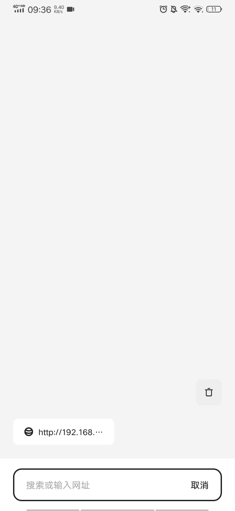

# vue-pop-router

50 行代码模拟一个vue 路由，到达新页面不会销毁旧页面 [详细解释](./StepByStep.md)


## Project setup
```
yarn install
```

### Compiles and hot-reloads for development
```
yarn serve
```

## 预览
>截图有点卡可以下载下来看



## 路由代码
```JavaScript
function VuePopRouter({ routers }) {
    // 存放路由数据，响应式对象驱动dom 变换
    const stackInfo = Vue.observable({
        pages: [],
    });

    // router 的根组件
    const view = {
        render(h) {
            const pages = stackInfo.pages.map((res, index) => {

                // 路由中所有的页面都是fixed 定位，后加入的页面层级高
                const instanceComponent = h('div', {
                    class: 'pop-in router-page',
                    style: {
                        zIndex: index
                    }
                }, [h(res.instance, { props: { ...res.params } })]);
                res.instanceComponent = instanceComponent;
                return instanceComponent
            })
            return h('div', {}, pages)
        },
    }
    this.push = (name, params) => {
        const findRouter = routers.find(res => res.name === name);
        if (!findRouter) return;
        const router = { ...findRouter }
        router.page.then(res => {
            router.instance = res.default;
            router.params = params

            // 页面栈中加入新页面
            stackInfo.pages.push(router);
        })

    }
    this.back = () => {
        if (stackInfo.pages.length <= 0) return;
        const lastEl = stackInfo.pages[stackInfo.pages.length - 1].instanceComponent.elm;
        lastEl.classList.remove('pop-in');
        lastEl.classList.add('pop-out')

        // 等待页面退出动画结束后，页面栈删除最后一页数据
        const onWebkitAnimationEnd = () => {
            lastEl.removeEventListener('webkitAnimationEnd', onWebkitAnimationEnd)
            stackInfo.pages.splice(-1, 1);
        }
        lastEl.addEventListener("webkitAnimationEnd", onWebkitAnimationEnd);
    }
    Vue.prototype.$router = this;

    // 生成全局组件，在App.vue 页面内调用，注册路由入口
    Vue.component('RouterView', view)
}
```

## App.vue 中注册入口

```JavaScript
<template>
  <div id="app">
    <router-view></router-view>
  </div>
</template>
```

## main.js 文件中初始化路由

```JavaScript
import VuePopRouter from './router'
const routers = [
  {
    name: 'home',
    page: import('./components/home.vue')
  },
  {
    name: 'Matryoshka',
    page: import('./components/Matryoshka.vue')
  }
]
new VuePopRouter({
  routers
})
```

## 切换页面
```JavaScript
this.$router.push("Matryoshka", { id: item });

this.$router.back();
```